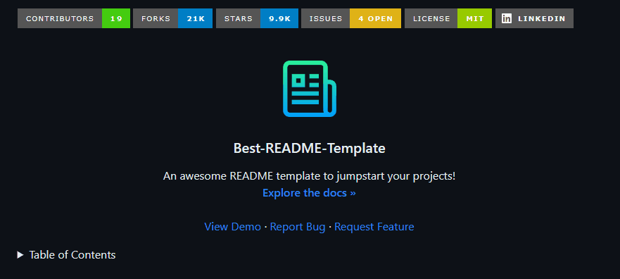

# Projeto com README
Um projeto de teste com um arquivo README 🚀

[]

## Tecnologias utilizadas
- HTML
- CSS

## Como utilizar

1 - Clone o projeto 
```
git clone
````

2 - Acesse a pasta do projeto
```
cd repositorio-com-readme
```
